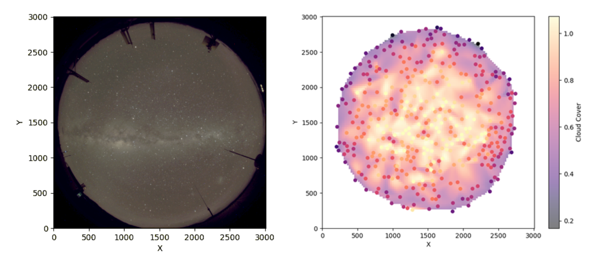
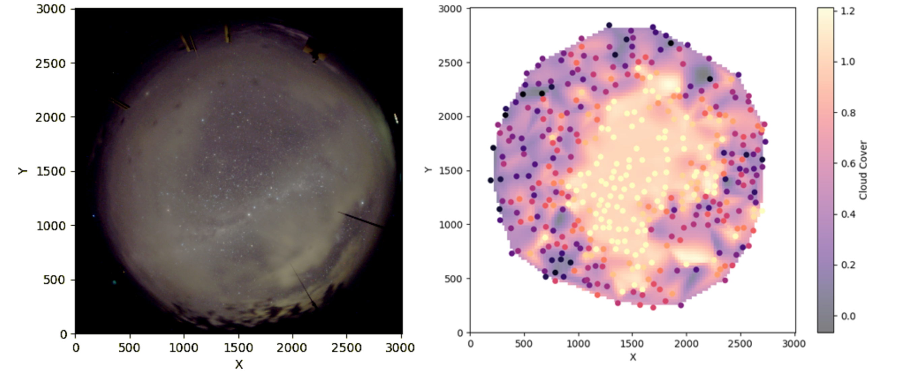

## Cloud Detector

This project was done for the Computer Vision course at the University of Canterbury in 2024 (COSC 428). 

I have uploaded it to GitHub purely for reference purposes. You can find the report I wrote about the project in the files. 

Feel free to use or adapt this code for your own needs. 

The script in its current state works reasonably well. It does not do atmospheric extinction correction, which causes it to overestimate clouds on the horizon. It also struggles when the moon is in frame. 

